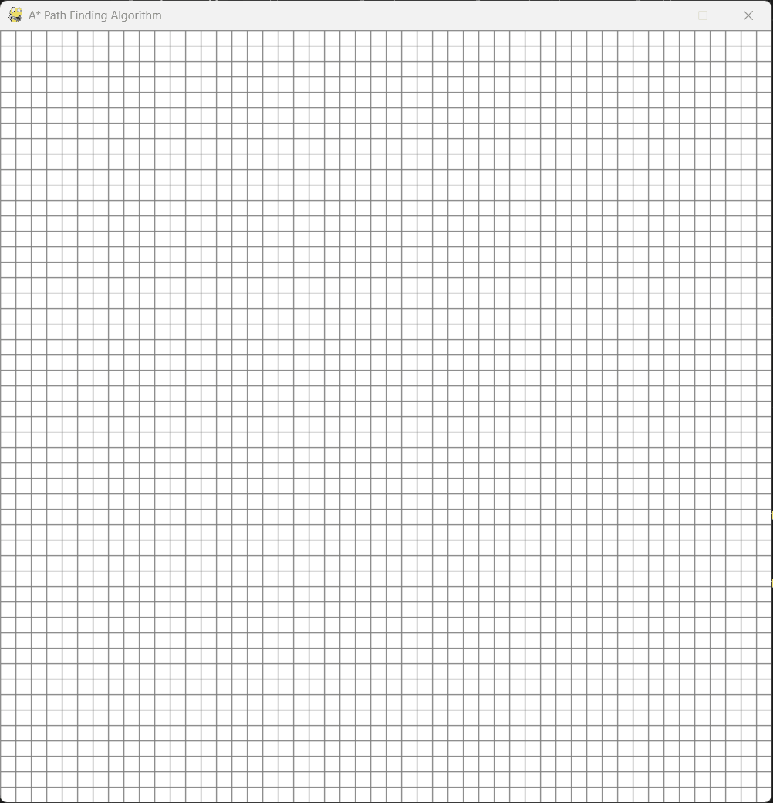

# A* PathFinder

Implementation of the A* search algorithm using Python and Pygame for interactive pathfinding visualization.



## Overview

This project provides a visual implementation of the A* pathfinding algorithm. Users can interactively set start points, end points, and barriers on a grid, then watch as the algorithm finds the optimal path between the start and end positions.

## Features

- Interactive grid-based interface
- Visual representation of the A* algorithm in action
- Real-time pathfinding with animated exploration
- Customizable barriers and obstacles
- Clean, modular Python architecture
- No external dependencies except Pygame

## Requirements

- Python 3.x
- Pygame

## Installation

1. Clone this repository:
```bash
git clone https://github.com/yourusername/A_Star_PathFinder.git
cd A_Star_PathFinder
```

2. Install Pygame:
```bash
pip install pygame
```

## Usage

Run the program:
```bash
python main.py
```

### Controls

- **Left Click**: Place start point (first click), end point (second click), or barriers (subsequent clicks)
- **Right Click**: Remove nodes (barriers, start, or end points)
- **Spacebar**: Start the A* algorithm (requires both start and end points)
- **C Key**: Clear the entire grid

### Color Legend

- **Orange**: Start point
- **Turquoise**: End point  
- **Black**: Barriers/obstacles
- **Green**: Open set (nodes being considered)
- **Red**: Closed set (nodes already evaluated)
- **Purple**: Final path from start to end

## Project Structure

```
A_Star_PathFinder/
├── main.py              # Entry point and pygame initialization
├── game_controller.py   # Main game loop and event handling
├── grid_manager.py      # Grid creation and visualization
├── node.py              # Individual grid node implementation
├── astar_algorithm.py   # A* pathfinding algorithm
├── constants.py         # Game settings and color definitions
└── README.md            # Project documentation
```

## Algorithm Details

The A* algorithm uses a heuristic-based approach to find the shortest path between two points. This implementation:

- Uses Manhattan distance as the heuristic function
- Employs a priority queue for efficient node selection
- Visualizes the exploration process in real-time
- Guarantees the optimal path when one exists

## Technical Implementation

- **Object-Oriented Design**: Clean separation of concerns with dedicated classes for nodes, grid management, and game control
- **Event-Driven Architecture**: Responsive input handling for interactive grid manipulation
- **Visual Feedback**: Real-time algorithm visualization with color-coded node states
- **Modular Structure**: Easy to extend and modify individual components

## Configuration

Modify `constants.py` to adjust:
- Grid size (default: 50x50)
- Window dimensions (default: 800x800)
- Algorithm delay for visualization speed
- Color scheme for different node types